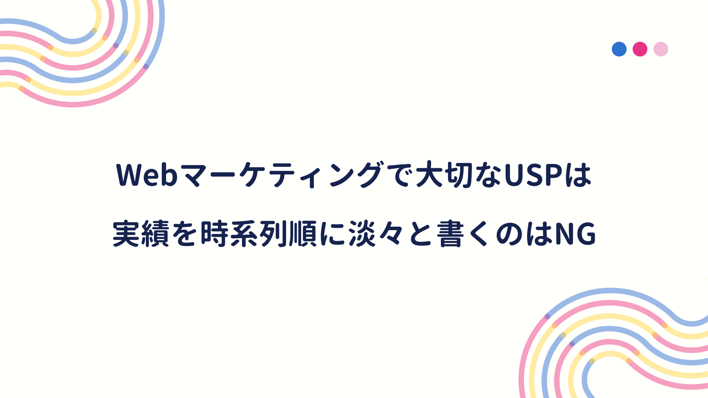

一般的な中小企業には、MAツールを使いこなせる人材が少ない。そのためMAツールを導入しても、マーケティングを自動化させるシナリオを設計できず、成果を挙げられない企業が多いらしい。

成果を挙げられない理由は他にもあるが、そもそもWebマーケティングの基本である **コンテンツ作り** に苦戦している企業が多いことを、マーケティング業界のクライアントに聞いたことがある。

その際、Webマーケティングに苦戦する人向けに、次の本が参考になると教えてくれた。

<a href="https://hb.afl.rakuten.co.jp/hgc/146fe51c.1fd043a3.146fe51d.605dc196/yomereba_main_202008151750078065?pc=http%3A%2F%2Fbooks.rakuten.co.jp%2Frb%2F13070114%2F%3Fscid%3Daf_ich_link_urltxt%26m%3Dhttp%3A%2F%2Fm.rakuten.co.jp%2Fev%2Fbook%2F" target="_blank" >あたらしいWebマーケティングの教科書</a>
posted with <a href="https://yomereba.com" rel="nofollow" target="_blank">ヨメレバ</a>

西俊明 技術評論社 2015年02月    

<a href="https://hb.afl.rakuten.co.jp/hgc/146fe51c.1fd043a3.146fe51d.605dc196/yomereba_main_202008151750078065?pc=http%3A%2F%2Fbooks.rakuten.co.jp%2Frb%2F13070114%2F%3Fscid%3Daf_ich_link_urltxt%26m%3Dhttp%3A%2F%2Fm.rakuten.co.jp%2Fev%2Fbook%2F" target="_blank" >楽天ブックス</a>

<a href="https://www.amazon.co.jp/exec/obidos/asin/4774171182/kanon123-22/" target="_blank" >Amazon</a>

<a href="https://www.amazon.co.jp/gp/search?keywords=%E3%81%82%E3%81%9F%E3%82%89%E3%81%97%E3%81%84Web%E3%83%9E%E3%83%BC%E3%82%B1%E3%83%86%E3%82%A3%E3%83%B3%E3%82%B0%E3%81%AE%E6%95%99%E7%A7%91%E6%9B%B8&__mk_ja_JP=%83J%83%5E%83J%83i&url=node%3D2275256051&tag=kanon123-22" target="_blank" >Kindle</a>
                              	  	  	  	  	

 

企業だけでなく、個人にも役立つ内容だったが、実践できる人はどの程度いるだろうか!?

話のついでに、自分の会社ホームページをチェックしてもらうと、幾つか改善すべき点を挙げてくれた。その改善点の一つが、第2章でも説明されている **USP（独自の強み）**の話。

本書では **技術・実績・想い** の3つに分解し、物語として **共感を生むこと** が大切だとしている。

・経歴と技術は因果関係で考える（○○の経験を通して、△△の技術を身に付けた）

・アピールしたいこと（経歴と技術のセット）を極力一つに絞り、できるだけ具体例で説明する

・どのような気持ちで取り組んできたのか、想いや情熱を言葉にする

 

また本書では、ダメなUSPとして **これまでやってきたことを時系列に並べる、または自分が出来ることを淡々と書くこと** を挙げており、まさに自身の経歴書だと猛省（ダメな理由は、聞く側はリアリティが感じられず、何がどの程度出来るか分からないし、キャリアの背景や人間性も感じられないから）

強みや経験が乏しい方は **想い** が大切だが、想いだけでは競合に真似され、USPにならない。

ちなみにWebライティングの本では、真似されないUSPの一例（若い二人が旅館を切り盛りする「弱み」を、他社に類を見ない親孝行プランを打ち出すことで「強み」に変える）が紹介されていた。

<a href="https://hb.afl.rakuten.co.jp/hgc/146fe51c.1fd043a3.146fe51d.605dc196/yomereba_main_202008221938514787?pc=http%3A%2F%2Fbooks.rakuten.co.jp%2Frb%2F14513758%2F%3Fscid%3Daf_ich_link_urltxt%26m%3Dhttp%3A%2F%2Fm.rakuten.co.jp%2Fev%2Fbook%2F" target="_blank" >沈黙のWebライティング</a>
posted with <a href="https://yomereba.com" rel="nofollow" target="_blank">ヨメレバ</a>

松尾茂起/上野高史 エムディエヌコーポレーション 2016年11月    

<a href="https://hb.afl.rakuten.co.jp/hgc/146fe51c.1fd043a3.146fe51d.605dc196/yomereba_main_202008221938514787?pc=http%3A%2F%2Fbooks.rakuten.co.jp%2Frb%2F14513758%2F%3Fscid%3Daf_ich_link_urltxt%26m%3Dhttp%3A%2F%2Fm.rakuten.co.jp%2Fev%2Fbook%2F" target="_blank" >楽天ブックス</a>

<a href="https://www.amazon.co.jp/exec/obidos/asin/4844366238/kanon123-22/" target="_blank" >Amazon</a>

<a href="https://www.amazon.co.jp/gp/search?keywords=%E6%B2%88%E9%BB%99%E3%81%AEWeb%E3%83%A9%E3%82%A4%E3%83%86%E3%82%A3%E3%83%B3%E3%82%B0&__mk_ja_JP=%83J%83%5E%83J%83i&url=node%3D2275256051&tag=kanon123-22" target="_blank" >Kindle</a>
                              	  	  	  	  	

 

本書では、旅館運営のUSPになりうる要素を、ハード面（温泉の質/施設/部屋の広さ/場所/景観）とソフト面（料理/接客/女将の個性/歴史/プラン）で洗い出し、以下の2軸で考察されている。

・競合に真似されにくい

・競合と同じステージで闘わずに済むこと

 

一つの考えに固執せず、複数の考えを掛け合わせたり、ニッチ市場をターゲットに、ニッチ分野の専門性を売りにするなど、日頃から考えていなければ、USPを生み出すのは意外に難しい気がする。